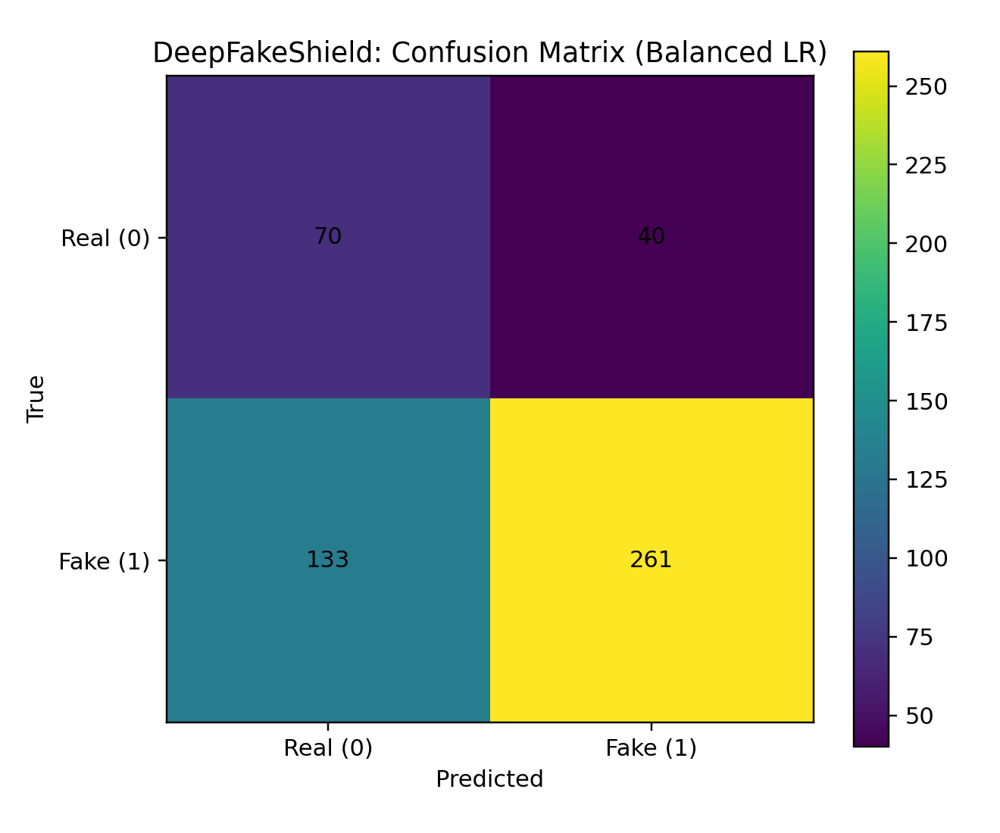

 DeepFakeShield: AI-Powered Media Authenticity Checker

DeepFakeShield is a machine learning system designed to detect deepfake media — manipulated images/videos — using lightweight vision features and supervised ML models.
It helps identify suspicious content and provides explainable outputs such as correlation heatmaps, accuracy curves, and confusion matrices.

 Features

Image/Video Analysis

Extracts visual features (brightness, contrast, color stats, histograms, edge density).

Trains a classifier to distinguish between real and fake images.

Machine Learning

Balanced Logistic Regression (default) with standardized features.

Handles imbalanced datasets (more real than fake or vice versa).

Outputs probability of fake for each input.

Evaluation & Visualization

Correlation heatmaps of features.

Accuracy-over-epochs curve.

Confusion matrix heatmap.

ROC & Precision-Recall curves.

Prediction

Batch prediction on test and sample sets.

Single-image prediction with probability of being fake.

 Project Structure
DeepFakeShield/
├─ archive/                               # dataset root
│   ├─ train-20250112T065955Z-001/
│   │   └─ train/
│   │       ├─ real/
│   │       └─ fake/
│   ├─ test-20250112T065939Z-001/
│   │   └─ test/
│   │       ├─ real/
│   │       └─ fake/
│   └─ Sample_fake_images/
│       └─ Sample_fake_images/fake/
├─ deepfakeshield_train_predict.py        # training + prediction script
├─ deepfakeshield_single_predict.py       # single image prediction
├─ outputs/                               # all generated artifacts
│   ├─ deepfakeshield_model.pkl
│   ├─ deepfakeshield_test_predictions.csv
│   ├─ deepfakeshield_sample_predictions.csv
│   ├─ deepfakeshield_metrics.json
│   ├─ deepfakeshield_confusion_matrix.png
│   ├─ deepfakeshield_roc_curve.png
│   ├─ deepfakeshield_pr_curve.png
│   ├─ deepfakeshield_feature_corr_heatmap.png
│   ├─ deepfakeshield_accuracy_over_epochs.png
│   ├─ deepfakeshield_accuracy_over_epochs.csv
│   ├─ deepfakeshield_feature_importance.csv
│   └─ deepfakeshield_classification_report.txt
└─ README.md

 Dataset

This project assumes you have real and fake images separated into folders:

Train set:

train/real/

train/fake/

Test set:

test/real/

test/fake/

Optional:

Sample_fake_images/fake/

Place them under DeepFakeShield/archive/ as shown above.

 Installation
pip install pandas numpy pillow scikit-image scikit-learn matplotlib joblib pyyaml tables

 Usage
1) Train & Predict

Run the main script to train a model and generate predictions + plots:

python deepfakeshield_train_predict.py

This will:

Train on train/real vs. train/fake images.

Predict on test/real, test/fake, and optional sample/fake.

Save model + predictions + metrics + plots to outputs/.

2) Single Image Prediction

Use the helper script to predict on one image:

python deepfakeshield_single_predict.py --img "archive/test/fake/88.jpg"

Example output:

=== DeepFakeShield Prediction ===
Image: archive/test/fake/88.jpg
Predicted Label: FAKE
Probability of Fake: 0.9231

3) Outputs

Model

deepfakeshield_model.pkl → trained scikit-learn pipeline

Predictions

deepfakeshield_test_predictions.csv

deepfakeshield_sample_predictions.csv

Metrics

deepfakeshield_metrics.json (ROC-AUC, PR-AUC, confusion matrix)

deepfakeshield_classification_report.txt

Visualizations

deepfakeshield_confusion_matrix.png

deepfakeshield_roc_curve.png

deepfakeshield_pr_curve.png

deepfakeshield_feature_corr_heatmap.png

deepfakeshield_accuracy_over_epochs.png

Feature Importance

deepfakeshield_feature_importance.csv

 Future Extensions

Replace hand-crafted features with CNN/transformer embeddings.

Extend to video deepfakes (frame-level + temporal cues).

Add audio deepfake detection (voice cloning).

Build a FastAPI service for real-time media authenticity checks.

Chrome extension for on-the-fly media verification.
Author

SAGNIK PATRA
